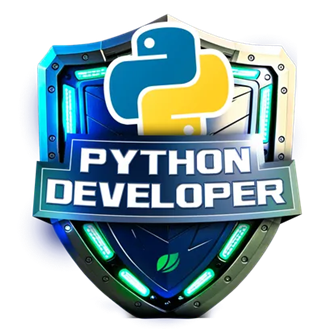

<pre style="font-size: 0.6rem;">

                              \\\\\\
                           \\\\\\\\\\\\
                          \\\\\\\\\\\\\\\
-------------,-|           |C>   // )\\\\|    .o88b. db   db  .d8b.  db    db  .d8b.  d888888b d888888b d88888b
           ,','|          /    || ,'/////|   d8P  Y8 88   88 d8' '8b 88    88 d8' '8b '~~88~~' '~~88~~' 88'  
---------,','  |         (,    ||   /////    8P      88ooo88 88ooo88 Y8    8P 88ooo88    88       88    88ooooo 
         ||    |          \\  ||||//''''|    8b      88~~~88 88~~~88 '8b  d8' 88~~~88    88       88    88~~~~~ 
         ||    |           |||||||     _|    Y8b  d8 88   88 88   88  '8bd8'  88   88    88       88    88.   
         ||    |______      ''''\____/ \      'Y88P' YP   YP YP   YP    YP    YP   YP    YP       YP    Y88888P
         ||    |     ,|         _/_____/ \
         ||  ,'    ,' |        /          |                 ___________________________________________
         ||,'    ,'   |       |         \  |              / \                                           \ 
_________|/    ,'     |      /           | |             |  |                                            | 
_____________,'      ,',_____|      |    | |              \ |      chavatte@duck.com                     | 
             |     ,','      |      |    | |                |                        chavatte.42web.io   | 
             |   ,','    ____|_____/    /  |                |    ________________________________________|___
             | ,','  __/ |             /   |                |  /                                            /
_____________|','   ///_/-------------/   |                 \_/____________________________________________/ 
              |===========,'                                                                              
			  

</pre>

# **Bootcamp Suzano - Python Developer**

Nesse repositório estão os projetos desenvolvidos no **Bootcamp Suzano - Python Developer**, esses projetos foram desenvolvidos em uma sequência lógica, iniciando com a criação de sistemas bancários em Python e culminando na utilização de ferramentas avançadas de IA da Azure. Essa abordagem prática visa fornecer uma base sólida e abrangente em desenvolvimento de software e inteligência artificial.

## Objetivo

O objetivo principal destes projetos é fornecer experiência prática no desenvolvimento de aplicações Python, abrangendo desde os conceitos básicos de programação até a utilização de ferramentas avançadas de IA

## Conteúdo Programático

* **Fundamentos da Programação Python**
* **Desenvolvimento de Pacotes Python**
* **Inteligência Artificial e Ferramentas da Azure**

## **Projetos**

* **LAB-01: Sistema Bancário Simples com Python:** [Link para o projeto](./projects/LAB-01/README.md)
* **LAB-02: Otimizando o Sistema Bancário com Funções Python:** [Link para o projeto](./projects/LAB-02/README.md)
* **LAB-03: Modelando o Sistema Bancário em POO com Python:** [Link para o projeto](./projects/LAB-03/README.md)
* **LAB-04: Criando um Pacote de Processamento de Imagens com Python:** [Link para o projeto](./projects/LAB-04/README.md)
* **LAB-05: Criando seu primeiro Copiloto no Microsoft Copilot Studio:** [Link para o projeto](./projects/LAB-05/README.md)
* **LAB-06: Criando um Copiloto com Fluxo de Conversa Personalizado no Microsoft Copilot Studio:** [Link para o projeto](./projects/LAB-06/README.md)
* **LAB-07: Análise de Sentimentos com Language Studio no Azure AI:** [Link para o projeto](./projects/LAB-07/README.md)

## Certificado de conclusão

 🎓 [Suzano - Python Developer]()
