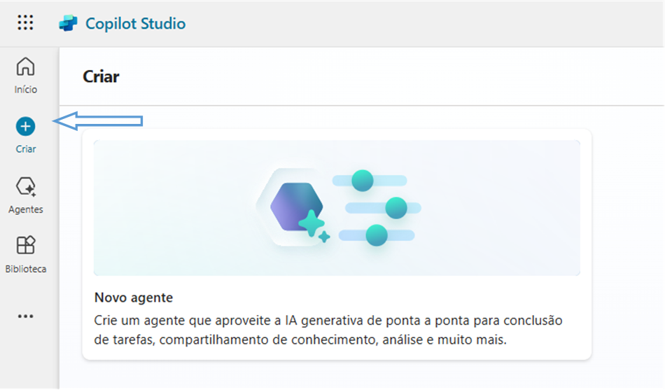

# LAB-05: Criando seu Primeiro Copiloto no Microsoft Copilot Studio

## Descrição

Este LAB abrange a criação de agentes inteligentes no Microsoft Copilot Studio, explorando diferentes métodos: modelos pré-definidos, descrições com IA e construção do zero.
O objetivo é fornecer uma visão abrangente das capacidades da plataforma, desde a personalização rápida com modelos até a criação detalhada de agentes em branco.

Criando um Agente baseado em Modelo no Microsoft Copilot Studio: Foco em Viagens Seguras

## Descrição

Nessa parte do projeto será demonstrado o processo de criação, publicação e otimização de um agente inteligente no Microsoft Copilot Studio, utilizando um modelo pré-definido como ponto de partida. O objetivo é criar um agente capaz de fornecer informações e suporte sobre viagens seguras, abordando questões comuns e preocupações dos usuários.

## Passo a Passo

1.  **Acesso ao Microsoft Copilot Studio:**
    * O primeiro passo é acessar a plataforma Microsoft Copilot Studio, onde encontramos a interface para criação e gerenciamento de agentes.

2.  **Seleção do Modelo:**
    * Na tela inicial, exploramos os modelos disponíveis e selecionamos a opção "Viagens Seguras". Este modelo oferece uma base pré-configurada com tópicos e informações relevantes sobre o tema.

    

3.  **Configuração do Agente:**
    * Nesta etapa, configuramos o agente com informações específicas:
        * **Nome:** Definimos o nome do agente como, exemplo: *"Chatbot Viagens Seguras"*.
        * **Descrição:** Adicionamos uma descrição clara do propósito do agente, exemplo: *"Agente responsável para verificação e consulta de rotas para viagens ao exterior"*.
        * **Instruções:** Fornecemos instruções detalhadas para o comportamento do agente, exemplo: *"Você é um especialista em viagens ao exterior saindo do Brasil. Você precisa responder de forma educada e como um especialista. Você representa a empresa que você representa se chama Chatbot Online e seu nome é Agente do Chatbot Online"*.
        * **Prompts Iniciais:** Adicionamos prompts iniciais para guiar as conversas.
        * **Conhecimento:** A base de conhecimento *"Lei de viagens nos EUA"* é **padrão**.
    * Essas configurações personalizam o agente e definem seu comportamento e conhecimento.

    

4.  **Personalização do Agente:**
    * Após a seleção do modelo, personalizamos o agente, adaptando as respostas e adicionando informações específicas sobre viagens seguras. Isso inclui detalhes sobre segurança em diferentes destinos, dicas de prevenção e informações sobre seguros de viagem.

5.  **Publicação do Agente:**
    * Após a configuração e personalização, iniciamos o processo de publicação do agente. Uma janela pop-up informa que o agente está sendo publicado em segundo plano, permitindo que continuemos trabalhando em outras tarefas.

    

6.  **Gerenciamento do Conhecimento:**
    * Na aba *"Conhecimento"*, visualizamos a fonte de dados utilizada pelo agente: *"Site de Viagens nos EUA"*.
    * A plataforma oferece sugestões para adicionar novas fontes de conhecimento, melhorar a taxa de respostas e acompanhar o uso do conhecimento.
    * Ferramentas de análise permitem verificar a taxa de erros e a taxa de respostas do agente.

    

## Recursos Utilizados

* Microsoft Copilot Studio
* Modelos pré-definidos de agentes
* Personalização de tópicos e respostas
* Configuração detalhada do agente (nome, descrição, instruções, prompts iniciais, conhecimento)
* Processo de publicação do agente

## Resultados Esperados

* Um agente inteligente capaz de fornecer informações precisas e úteis sobre viagens seguras.
* Melhora na experiência do usuário ao obter respostas rápidas e confiáveis sobre questões de segurança em viagens.
* Agente publicado e disponível para interação.
* Otimização contínua do agente com base em análises de desempenho e gerenciamento do conhecimento.
* Potencial para expansão do agente com funcionalidades adicionais, como integração com serviços de seguro e informações de destinos específicos.

## Nível de Conhecimento

* Este projeto é adequado para iniciantes e usuários intermediários que desejam explorar a criação, publicação e otimização de agentes inteligentes no Microsoft Copilot Studio.

## Informações Adicionais

* A utilização de modelos pré-definidos acelera o processo de criação de agentes, permitindo focar na personalização e adaptação às necessidades específicas.
* A configuração detalhada do agente garante que ele se comporte de acordo com as expectativas e forneça informações relevantes.
* A publicação do agente torna-o acessível para os usuários interagirem.
* O gerenciamento e análise do conhecimento permitem otimizar o desempenho do agente e garantir a precisão das respostas.
* A integração com outras fontes de informação e serviços pode enriquecer ainda mais a funcionalidade do agente.

Criando seu Agente baseado em descrição com IA: Assistente de Viagens

## Descrição

Nessa parte do projeto será explorado a criação de um agente inteligente utilizando descrições textuais e inteligência artificial no Microsoft Copilot Studio. O objetivo é criar um assistente de viagens para a empresa Chavatte Online, capaz de fornecer informações completas sobre os requisitos para viagens internacionais partindo do Brasil.

## Passo a Passo

1.  **Descrição do Agente:**
    * Utilizando a interface do Microsoft Copilot Studio, o agente foi descrito com o seguinte prompt: *"Crie um agente de viagens para a empresa Chavatte Online ele irá ser responsável por listar todos os requisitos para viajar ao exterior partindo do Brasil. Esse agente irá consultar informações de uma base de dados do Excel."*

    

2.  **Utilização de IA e Configuração Inicial:**
    * A plataforma utiliza inteligência artificial para interpretar a descrição e gerar um agente com configurações iniciais.
    * **Idioma:** Diferentemente do projeto anterior, a IA configurou automaticamente o idioma do agente para **Português (Brasil) (pt-BR)**.
    * **Interface:** A interface de configuração segue o padrão do Microsoft Copilot Studio, com campos para:
        * **Nome:** Para definir um nome personalizado para o agente.
        * **Ícone:** Para adicionar um ícone representativo.
        * **Descrição:** Para detalhar o propósito e o público-alvo do agente.
        * **Instruções:** Para direcionar o comportamento e as tarefas do agente.
        * **Prompts Iniciais:** Para sugerir formas de iniciar conversas.
        * **Conhecimento:** Para adicionar dados e arquivos que o agente usará para aprender.

    

3.  **Base de dados:**
    * O Agente se conectará a uma base de dados do excel para buscar as informações necessárias.

## Recursos Utilizados

* Microsoft Copilot Studio
* Descrição textual para criação de agentes
* Inteligência artificial para interpretação de descrições e configuração inicial
* Conexão com base de dados do Excel

## Resultados Esperados

* Um agente de viagens capaz de fornecer informações sobre requisitos para viagens internacionais.
* Agente integrado com uma base de dados do Excel para consulta de informações.
* Utilização da IA para criar um agente baseado em descrição e configurar o idioma automaticamente.

## Informações Adicionais

* Este recurso da plataforma está em versão preliminar, o que pode influenciar a funcionalidade e o desempenho do agente.
* A base de dados do Excel precisa estar organizada e com as informações necessárias.
* A configuração automática do idioma pela IA demonstra a capacidade da plataforma de adaptar-se às necessidades do usuário.

Criando um Agente em Branco no Microsoft Copilot Studio

## Descrição

Nessa parte do projeto será demontrado o processo de criação de um agente inteligente do zero no Microsoft Copilot Studio, sem utilizar modelos pré-definidos ou descrições com IA. O objetivo é explorar as funcionalidades da plataforma e criar um agente personalizado para atender às necessidades específicas do usuário.

## Passo a Passo

1.  **Acesso à Criação de Agente:**
    * Navegamos até a seção "Criar" no Microsoft Copilot Studio.
    * Clicamos no botão "+" "Criar" para iniciar a criação de um novo agente.

    

2.  **Criação em Branco e Configuração Inicial:**
    * Criar um agente em branco, sem utilizar modelos ou descrições com IA.
    * **Idioma:** Configurado o idioma do agente para **Português (Brasil) (pt-BR)**.
    * **Nome:** Foi definido o nome do agente como **"Chavatte Agente"**.
    * **Descrição:** Foi adicionada uma descrição inicial: **"Esse agente será responsável em responder todas as dúvidas sobre IA."**
    * **Ícone:** Foi adicionado também um ícone representativo para o agente.
    * **Instruções:** (Campo em branco) 
    * **Prompts Iniciais:** (Campo em branco)
    * **Conhecimento:** (Campo em branco)

    

3.  **Teste do Agente:**
    * Pergunta "O que é o Copilot Studio?".
    * O agente gerou uma resposta explicando o que é o Copilot Studio, suas funcionalidades e benefícios.
    * A resposta gerada pela IA é apresentada na tela de teste.

    

## Recursos Utilizados

* Microsoft Copilot Studio
* Criação de agente em branco
* Configuração manual do agente (nome, descrição, ícone, idioma)
* Tela de teste para interação com o agente
* IA generativa para geração de respostas

## Resultados Esperados

* Um agente inteligente criado do zero.
* Exploração das funcionalidades da plataforma Microsoft Copilot Studio.
* Personalização completa do agente.
* Configuração inicial manual do agente.
* Geração de respostas pela IA com base na pergunta do usuário.

## Informações Adicionais

* Essa parte do projeto permite um maior controle sobre a criação do agente, desde a definição de tópicos e respostas até a integração com outros serviços.
* A criação em branco exige um maior conhecimento da plataforma e das funcionalidades disponíveis.
* A configuração inicial manual permite personalizar o agente de acordo com as necessidades específicas do usuário.
* A tela de teste permite verificar a funcionalidade do agente e a qualidade das respostas geradas pela IA.

## Tecnologias Utilizadas

* **Microsoft Copilot Studio:** Plataforma para criação e gerenciamento de agentes inteligentes.
* **Inteligência Artificial (IA):** Utilizada para interpretação de descrições, geração de respostas e otimização de agentes.
* **Modelos Pré-definidos:** Agilizam a criação de agentes com funcionalidades comuns.

## Aprendizado

* **Criação de Agentes com Modelos:** Conhecimento inicial em usar modelos pré-definidos para criar agentes de forma rápida e eficiente, personalizando-os para atender a necessidades específicas.
* **Criação de Agentes com Descrição de IA:** Explorando a capacidade da IA de interpretar descrições textuais e gerar agentes funcionais, otimizando o processo de desenvolvimento.
* **Criação de Agentes em Branco:** Experiência inicial na criação de agentes do zero, compreendendo as funcionalidades do Microsoft Copilot Studio e personalizando os detalhes.
* **Gerenciamento do Conhecimento:** Gerenciar e otimizar o conhecimento do agente para garantir respostas precisas e relevantes.

## Conclusão

Este LAB demonstrou a versatilidade do Microsoft Copilot Studio na criação de agentes inteligentes. Através da exploração de diferentes métodos, desde modelos pré-definidos até a criação em branco, demonstrando a capacidade da plataforma e o potencial da IA na automação de tarefas e na melhoria da experiência do usuário. A capacidade de personalizar agentes de acordo com necessidades específicas, integrando-os com outras ferramentas e serviços, torna o Microsoft Copilot Studio uma ferramenta poderosa para a criação de soluções inovadoras.