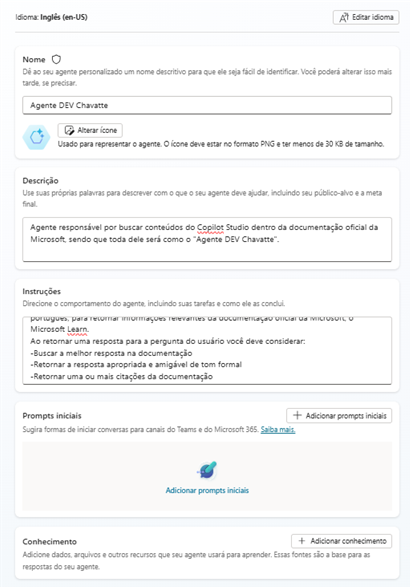
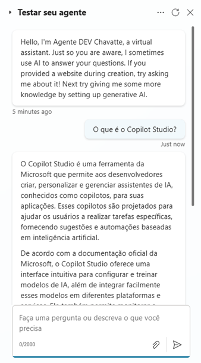
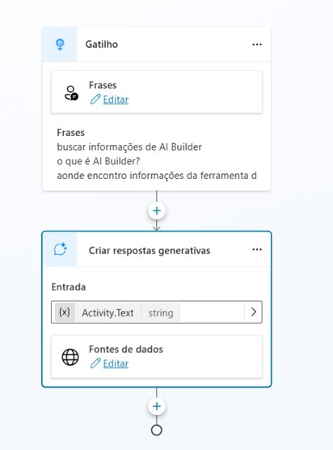
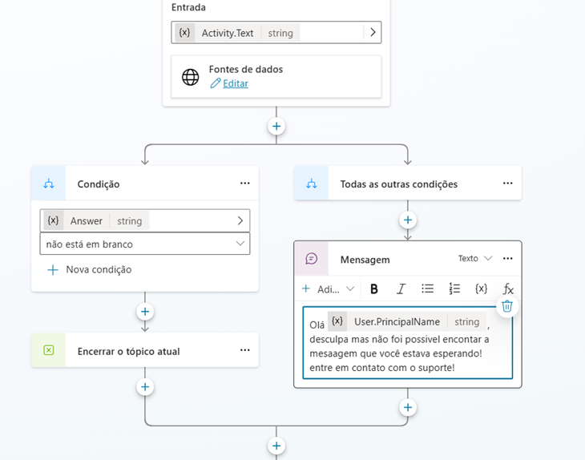

# LAB-06: Criando um Copiloto com Fluxo de Conversa Personalizado no Microsoft Copilot Studio

## Descrição Geral

Este LAB tem como objetivo demonstrar a criação de um Copiloto com fluxo de conversa personalizado no Microsoft Copilot Studio. O foco será na construção de um agente em branco, configurando suas funcionalidades manualmente e definindo um fluxo de conversa específico para atender a um propósito definido.

## Parte 1: Criação e Configuração Inicial do Agente

### Descrição

Nesta primeira parte, criaremos um agente em branco e configuraremos suas definições básicas. O objetivo é estabelecer a base para um Copiloto personalizado que será desenvolvido nas próximas etapas.

### Passo a Passo

1.  **Criação do Agente:**
    * Um novo agente em branco foi criado com sucesso no Microsoft Copilot Studio.

2.  **Configuração Inicial:**
    * **Nome:** O agente foi nomeado como "Agente DEV Chavatte".
    * **Descrição:** Foi definida a descrição: "Agente responsável por buscar conteúdos do Copilot Studio dentro da documentação oficial da Microsoft, sendo que toda dele será como o 'Agente DEV Chavatte'."
    * **Instruções:** Instruções detalhadas foram adicionadas para guiar o comportamento do agente:
        * "Buscar a melhor resposta na documentação."
        * "Retornar a resposta apropriada e amigável de tom formal."
        * "Retornar uma ou mais citações da documentação."
    * **Idioma:** O idioma foi definido como Português (Brasil) (pt-BR).
    * **Conhecimento:** A seção de conhecimento está presente, mas nenhuma fonte de conhecimento foi adicionada nesta etapa.

    

3.  **Teste Inicial do Agente:**
    * Utilizamos a tela de teste para interagir com o agente.
    * Digitamos a pergunta "O que é o Copilot Studio?".
    * O agente gera uma resposta explicando o que é o Copilot Studio, suas funcionalidades e benefícios, com base na documentação oficial da Microsoft.
    * A resposta gerada pela IA é apresentada na tela de teste.

    

## Parte 2: Personalização de Tópico com Respostas Generativas, Mensagem de Erro e Moderação de Conteúdo

### Descrição

Nesta segunda parte, customizamos um tópico específico dentro do projeto, criando um fluxo de conversa personalizado com respostas generativas, mensagem de erro personalizada e moderação de conteúdo.

### Passo a Passo

1.  **Criação do Tópico:**
    * Um novo tópico foi criado a partir de um documento em branco.

2.  **Configuração do Gatilho:**
    * O gatilho do tópico foi configurado com as seguintes frases:
        * "buscar informações de AI Builder"
        * "o que é AI Builder?"
        * "aonde encontro informações da ferramenta da ferramenta de AI da Power Plataform"

3.  **Adição e Configuração do Nó de Respostas Generativas:**
    * Um nó de respostas generativas foi adicionado ao tópico, utilizando a opção "Avançado".
    * A entrada para o nó de respostas generativas foi configurada para utilizar `Activity.Text` (a pergunta do usuário).
    * As fontes de dados para o nó de respostas generativas foram configuradas.

    

4.  **Personalização da Mensagem de Erro:**
    * Nas configurações de fonte de dados do nó de respostas generativas, a opção "Permitir que a IA use seus próprios conhecimentos gerais (versão preliminar)" foi desabilitada.
    * Uma condição foi adicionada para verificar se a resposta do nó de respostas generativas está em branco.
    * Caso a resposta esteja em branco, a seguinte mensagem de erro personalizada será exibida:
        * "Olá {User.PrincipalName}, desculpa mas não foi possível encontrar a mensagem que você estava esperando! Entre em contato com o suporte!"

    

5.  **Personalização da Moderação de Conteúdo:**
    * Nas configurações de fonte de dados do nó de respostas generativas, a opção "Nível de moderação de conteúdo" foi ativada e personalizada como "Alto".
    * A seguinte mensagem personalizada foi criada para ser exibida quando o conteúdo gerado pela IA for considerado de baixa qualidade ou inadequado:
        * "Desculpe, não foi possível gerar uma resposta adequada com base nas informações disponíveis. Por favor, reformule sua pergunta ou tente novamente mais tarde."

6.  **Testes do Tópico:**
    * O tópico personalizado foi testado com sucesso, demonstrando que o fluxo de conversa funciona conforme o esperado, incluindo a mensagem de erro personalizada e a moderação de conteúdo.

### Recursos Utilizados

* Microsoft Copilot Studio
* Criação e configuração de tópicos
* Gatilhos com frases personalizadas
* Nó de respostas generativas com entrada `Activity.Text`
* Mensagem de erro personalizada
* Condição para verificar resposta em branco
* Moderação de conteúdo personalizada

### Resultados Esperados

* Tópico personalizado criado com gatilho, nó de respostas generativas, mensagem de erro personalizada e moderação de conteúdo configurados.
* Fluxo de conversa personalizado para responder a perguntas sobre AI Builder, utilizando a pergunta do usuário como entrada para o nó de respostas generativas.
* Mensagem de erro personalizada exibida caso o agente não encontre informações relevantes nas fontes de dados.
* Moderação de conteúdo personalizada para controlar a qualidade das respostas geradas pela IA.
* Testes realizados com sucesso, demonstrando o funcionamento correto do fluxo de conversa.

### Informações Adicionais

* A criação de tópicos personalizados permite definir fluxos de conversa específicos para diferentes assuntos.
* O nó de respostas generativas utiliza a IA para buscar e fornecer informações relevantes com base nas fontes de dados configuradas e na pergunta do usuário (`Activity.Text`).
* A mensagem de erro personalizada melhora a experiência do usuário ao fornecer um feedback mais claro em casos de falha na busca de informações.
* A moderação de conteúdo personalizada permite controlar a qualidade das respostas geradas pela IA, garantindo que o conteúdo seja adequado e relevante.
