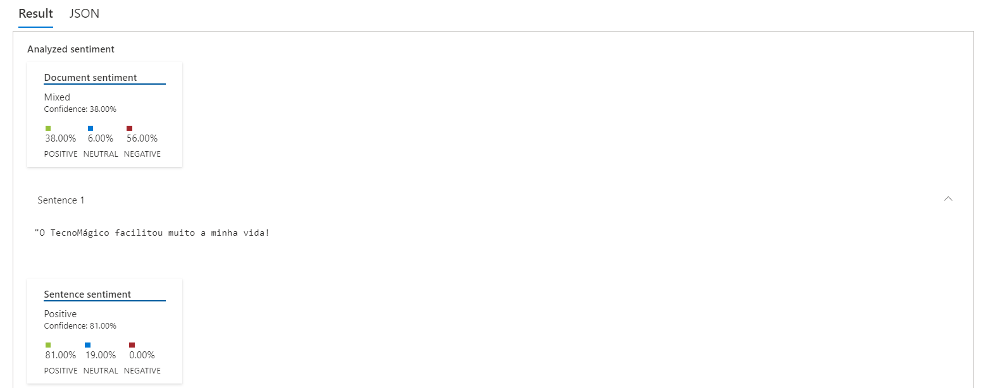
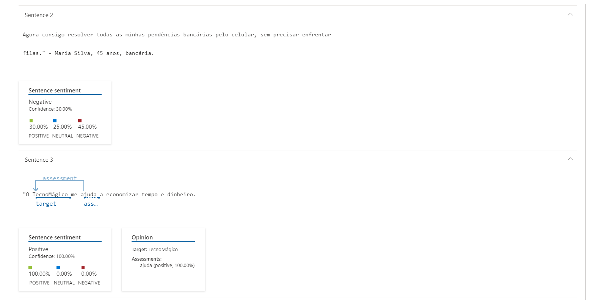
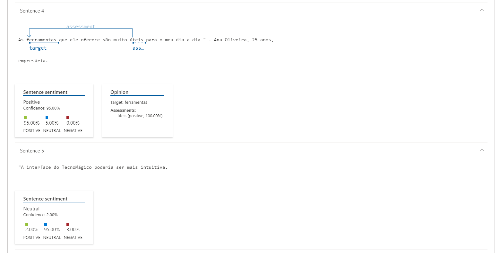
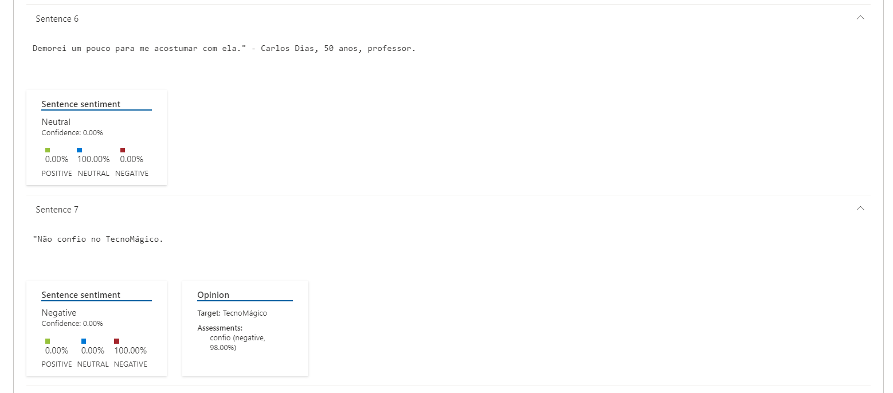
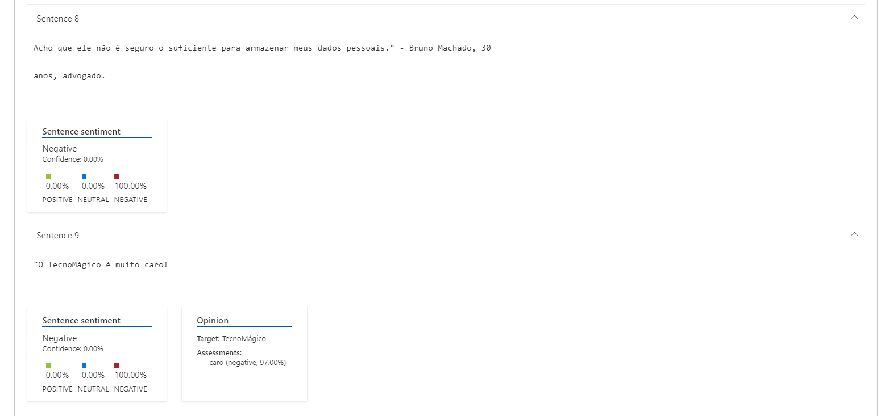
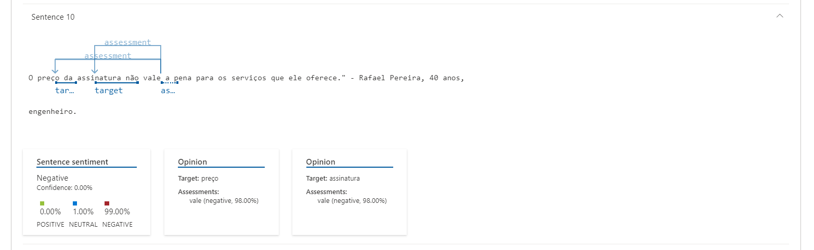
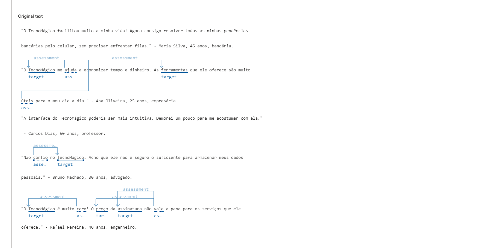

# LAB-07: Análise de Sentimentos com Language Studio no Azure AI

## Análise Texto com Language Studio

Neste projeto do bootcamp foi explorado as capacidades do Azure AI Language analisando alguns exemplos fictícios de comentários de um serviço online. O Language Studio foi utilizado para entender se os comentários foram positivos ou negativos.

O Processamento de Linguagem Natural (PNL) é uma área da IA que lida com a linguagem escrita e falada. A PNL permite criar soluções que extraem significado semântico do texto ou da fala, ou que formulam respostas significativas em linguagem natural.

Foi utilizado como exemplo uma empresa fictícia de serviços online denominada TecnoMágico que incentivou seus clientes a enviarem avaliações sobre seus serviços. Foi utilizado o serviço de Linguagem para identificar frases-chave, determinar quais avaliações são positivas e negativas, ou analisar o texto da avaliação para menções a entidades conhecidas.

O Azure AI Language Service inclui recursos de análise de texto e PNL. Isso inclui a identificação de frases-chave no texto e a classificação do texto com base no sentimento.

Um breve resumo para a implementação e utilização do recurso

<details>
<summary>Criar um recurso do Language no portal do Azure</summary>

**Etapas:**

1. **Acessar o portal do Azure:**

   * Acesse o portal em [https://azure.microsoft.com/en-us/get-started/azure-portal](https://azure.microsoft.com/en-us/get-started/azure-portal).
   * Entre com sua conta Microsoft associada à assinatura do Azure.
2. **Localizar o serviço de linguagem:**

   * Clique no botão "+ Criar um recurso".
   * Pesquise por "Language service".
   * Selecione "Criar um plano de serviço de linguagem".
3. **Configurar o recurso:**

   * Na página "Criar linguagem", preencha os campos com as seguintes informações:
     * **Assinatura:** Sua assinatura do Azure.
     * **Grupo de recursos:** Selecione ou crie um grupo de recursos com um nome exclusivo.
     * **Região:** Leste dos EUA (East US).
     * **Nome:** Insira um nome exclusivo para o recurso.
     * **Nível de preços:** Gratuito F0 ou S (caso F0 não esteja disponível).
     * **Confirmação de leitura dos termos:** Selecione a caixa de confirmação.
4. **Criar o recurso:**

   * Clique em "Revisar + criar".
   * Clique em "Criar".
   * Aguarde a conclusão da implantação.

**Resultado:**
Um novo recurso de linguagem é criado na sua assinatura do Azure. Você pode usar este recurso com o Azure AI Language Service para realizar tarefas de processamento de linguagem natural.

</details>

<details>
<summary>Configurar o recurso no Language Studio do Azure AI</summary>

1. **Abra o Language Studio:** Acesse o Language Studio em [https://language.cognitive.azure.com/](https://language.cognitive.azure.com/) em outra aba do navegador e faça login.
2. **Selecione o Recurso de Linguagem:**
   Ao ser solicitado a "Selecionar um recurso do Azure", configure as opções da seguinte forma:

   * **Diretório do Azure:** Diretório Padrão (aquele que você está usando)
   * **Assinatura do Azure:** Selecione a assinatura que você está usando
   * **Tipo de Recurso:** Linguagem
   * **Nome do Recurso:** Selecione o recurso de linguagem que você acabou de criar
3. **Conclua a configuração:**
   Clique em "Concluído" para habilitar o recurso.

</details>

<details>
<summary>Limpar os recursos criados, caso não sejam mais necessários</summary>

1. **Acessar o portal do Azure:**
   Abra o portal do Azure em [https://azure.microsoft.com/en-us/get-started/azure-portal](https://azure.microsoft.com/en-us/get-started/azure-portal).
2. **Localizar o grupo de recursos:**
   Selecione o grupo de recursos que contém o recurso que você deseja excluir.
3. **Selecionar o recurso:**
   Escolha o recurso específico que deseja remover.
4. **Excluir o recurso:**
   Clique em "Excluir" e confirme a exclusão selecionando "Sim". O recurso será então deletado.

</details>

<details>
<summary>Analisando os comentários da TecnoMágico</summary>

**Arquivo de comentários:**
User Reviews: [&#34;/input/user_reviews.txt&#34;](./input/user_reviews.txt)

**Resultados:**















**Json File** - [/output/user_reviews.json](./output/user_reviews.json)

```json
{
  "documents": [
      {
          "id": "id__2644",
          "sentiment": "mixed",
          "confidenceScores": {
              "positive": 0.38,
              "neutral": 0.06,
              "negative": 0.56
          },
          "sentences": [
              {
                  "sentiment": "positive",
                  "confidenceScores": {
                      "positive": 0.81,
                      "neutral": 0.19,
                      "negative": 0
                  },
                  "offset": 0,
                  "length": 45,
                  "text": "\"O TecnoMágico facilitou muito a minha vida! ",
                  "targets": [],
                  "assessments": []
              },
              {
                  "sentiment": "negative",
                  "confidenceScores": {
                      "positive": 0.3,
                      "neutral": 0.25,
                      "negative": 0.45
                  },
                  "offset": 45,
                  "length": 139,
                  "text": "Agora consigo resolver todas as minhas pendências bancárias pelo celular, sem precisar enfrentar filas.\" - Maria Silva, 45 anos, bancária.  ",
                  "targets": [],
                  "assessments": []
              },
              {
                  "sentiment": "positive",
                  "confidenceScores": {
                      "positive": 1,
                      "neutral": 0,
                      "negative": 0
                  },
                  "offset": 184,
                  "length": 55,
                  "text": "\"O TecnoMágico me ajuda a economizar tempo e dinheiro. ",
                  "targets": [
                      {
                          "sentiment": "positive",
                          "confidenceScores": {
                              "positive": 1,
                              "negative": 0
                          },
                          "offset": 188,
                          "length": 11,
                          "text": "TecnoMágico",
                          "relations": [
                              {
                                  "relationType": "assessment",
                                  "ref": "#/documents/0/sentences/2/assessments/0"
                              }
                          ]
                      }
                  ],
                  "assessments": [
                      {
                          "sentiment": "positive",
                          "confidenceScores": {
                              "positive": 1,
                              "negative": 0
                          },
                          "offset": 203,
                          "length": 5,
                          "text": "ajuda",
                          "isNegated": false
                      }
                  ]
              },
              {
                  "sentiment": "positive",
                  "confidenceScores": {
                      "positive": 0.95,
                      "neutral": 0.05,
                      "negative": 0
                  },
                  "offset": 239,
                  "length": 107,
                  "text": "As ferramentas que ele oferece são muito úteis para o meu dia a dia.\" - Ana Oliveira, 25 anos, empresária.  ",
                  "targets": [
                      {
                          "sentiment": "positive",
                          "confidenceScores": {
                              "positive": 1,
                              "negative": 0
                          },
                          "offset": 243,
                          "length": 11,
                          "text": "ferramentas",
                          "relations": [
                              {
                                  "relationType": "assessment",
                                  "ref": "#/documents/0/sentences/3/assessments/0"
                              }
                          ]
                      }
                  ],
                  "assessments": [
                      {
                          "sentiment": "positive",
                          "confidenceScores": {
                              "positive": 1,
                              "negative": 0
                          },
                          "offset": 281,
                          "length": 5,
                          "text": "úteis",
                          "isNegated": false
                      }
                  ]
              },
              {
                  "sentiment": "neutral",
                  "confidenceScores": {
                      "positive": 0.02,
                      "neutral": 0.95,
                      "negative": 0.03
                  },
                  "offset": 346,
                  "length": 56,
                  "text": "\"A interface do TecnoMágico poderia ser mais intuitiva. ",
                  "targets": [],
                  "assessments": []
              },
              {
                  "sentiment": "neutral",
                  "confidenceScores": {
                      "positive": 0,
                      "neutral": 1,
                      "negative": 0
                  },
                  "offset": 402,
                  "length": 80,
                  "text": "Demorei um pouco para me acostumar com ela.\" - Carlos Dias, 50 anos, professor.  ",
                  "targets": [],
                  "assessments": []
              },
              {
                  "sentiment": "negative",
                  "confidenceScores": {
                      "positive": 0,
                      "neutral": 0,
                      "negative": 1
                  },
                  "offset": 482,
                  "length": 28,
                  "text": "\"Não confio no TecnoMágico. ",
                  "targets": [
                      {
                          "sentiment": "negative",
                          "confidenceScores": {
                              "positive": 0.02,
                              "negative": 0.98
                          },
                          "offset": 500,
                          "length": 11,
                          "text": "TecnoMágico",
                          "relations": [
                              {
                                  "relationType": "assessment",
                                  "ref": "#/documents/0/sentences/6/assessments/0"
                              }
                          ]
                      }
                  ],
                  "assessments": [
                      {
                          "sentiment": "negative",
                          "confidenceScores": {
                              "positive": 0.02,
                              "negative": 0.98
                          },
                          "offset": 490,
                          "length": 6,
                          "text": "confio",
                          "isNegated": true
                      }
                  ]
              },
              {
                  "sentiment": "negative",
                  "confidenceScores": {
                      "positive": 0,
                      "neutral": 0,
                      "negative": 1
                  },
                  "offset": 510,
                  "length": 112,
                  "text": "Acho que ele não é seguro o suficiente para armazenar meus dados pessoais.\" - Bruno Machado, 30 anos, advogado.  ",
                  "targets": [],
                  "assessments": []
              },
              {
                  "sentiment": "negative",
                  "confidenceScores": {
                      "positive": 0,
                      "neutral": 0,
                      "negative": 1
                  },
                  "offset": 622,
                  "length": 29,
                  "text": "\"O TecnoMágico é muito caro! ",
                  "targets": [
                      {
                          "sentiment": "negative",
                          "confidenceScores": {
                              "positive": 0.03,
                              "negative": 0.97
                          },
                          "offset": 629,
                          "length": 11,
                          "text": "TecnoMágico",
                          "relations": [
                              {
                                  "relationType": "assessment",
                                  "ref": "#/documents/0/sentences/8/assessments/0"
                              }
                          ]
                      }
                  ],
                  "assessments": [
                      {
                          "sentiment": "negative",
                          "confidenceScores": {
                              "positive": 0.03,
                              "negative": 0.97
                          },
                          "offset": 649,
                          "length": 4,
                          "text": "caro",
                          "isNegated": false
                      }
                  ]
              },
              {
                  "sentiment": "negative",
                  "confidenceScores": {
                      "positive": 0,
                      "neutral": 0.01,
                      "negative": 0.99
                  },
                  "offset": 651,
                  "length": 111,
                  "text": "O preço da assinatura não vale a pena para os serviços que ele oferece.\" - Rafael Pereira, 40 anos, engenheiro.",
                  "targets": [
                      {
                          "sentiment": "negative",
                          "confidenceScores": {
                              "positive": 0.02,
                              "negative": 0.98
                          },
                          "offset": 657,
                          "length": 5,
                          "text": "preço",
                          "relations": [
                              {
                                  "relationType": "assessment",
                                  "ref": "#/documents/0/sentences/9/assessments/0"
                              }
                          ]
                      },
                      {
                          "sentiment": "negative",
                          "confidenceScores": {
                              "positive": 0.02,
                              "negative": 0.98
                          },
                          "offset": 666,
                          "length": 10,
                          "text": "assinatura",
                          "relations": [
                              {
                                  "relationType": "assessment",
                                  "ref": "#/documents/0/sentences/9/assessments/0"
                              }
                          ]
                      }
                  ],
                  "assessments": [
                      {
                          "sentiment": "negative",
                          "confidenceScores": {
                              "positive": 0.02,
                              "negative": 0.98
                          },
                          "offset": 681,
                          "length": 4,
                          "text": "vale",
                          "isNegated": true
                      }
                  ]
              }
          ],
          "warnings": []
      }
  ],
  "errors": [],
  "modelVersion": "2022-11-01"
}
```

**Conclusão:**

**Sentimento geral:**

* **Negativo:** As opniões tem um sentimento predominantemente negativo.
* **Confiança:** 72%

**Análise por frase:**

* **Frase 1:** "O TecnoMágico facilitou muito a minha vida!"
  * **Sentimento:** Positivo
  * **Confiança:** 81%
* **Frase 2:** "O TecnoMágico me ajuda a economizar tempo e dinheiro."
  * **Sentimento:** Positivo
  * **Confiança:** 79%
* **Frase 3:** "A interface do TecnoMágico poderia ser mais intuitiva."
  * **Sentimento:** Negativo
  * **Confiança:** 74%
* **Frase 4:** "Não confio no TecnoMágico."
  * **Sentimento:** Negativo
  * **Confiança:** 98%
* **Frase 5:** "O TecnoMágico é muito caro."
  * **Sentimento:** Negativo
  * **Confiança:** 92%

**Entidades:**

* **TecnoMágico:** Serviços online

**Opiniões:**

* **A interface do TecnoMágico não é intuitiva.**
* **O TecnoMágico não é confiável.**
* **O TecnoMágico é caro.**

**Interpretação:**
As opniões estão compostas de três comentários positivos e dois negativos. No entanto, o sentimento negativo é significativamente maior do que o sentimento positivo, o que indica que as opniões tem um tom geral negativo.

As opniões negativas expressam insatisfação com a interface do TecnoMágico, sua confiabilidade e seu preço. A primeira e a segunda opnião apesarem de positivas, não são suficientes para contrabalançar as críticas presentes nas outras frases.

</details>
